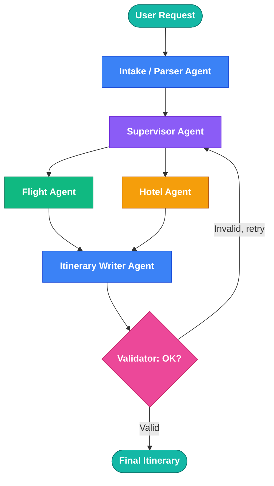

# Multi-Agent Travel Itinerary System — Architecture

## Overview

This document outlines the architecture for a text-based multi-agent AI travel itinerary planner built with LangGraph.

## Flow Diagram



**Editable version in Lucid:** https://lucid.app/lucidchart/3b150f1e-8f55-4db8-b0d0-4224db7f4ab5/edit

## Agent Responsibilities

| Agent | Responsibility |
|---|---|
| Intake / Parser Agent | Extracts origin, destination, dates, budget, and interests from the user's free-text request into the shared state object |
| Supervisor Agent | Decides which specialist agent to call next based on current state; routes retries when validation fails |
| Flight Agent | Calls flight API (Amadeus / Aviationstack), writes flight options into state |
| Hotel Agent | Calls hotel API (Booking.com / Amadeus), writes hotel options into state |
| Itinerary Writer Agent | Combines flights, hotels, and interests into a day-by-day plan, returned as structured JSON |
| Validator | Checks the draft itinerary against budget and dates; loops back to Supervisor if something's off |

## Shared State Schema (Pydantic)

```python
class TripState(BaseModel):
    origin: str
    destination: str
    start_date: str
    end_date: str
    budget: float
    interests: list[str]
    flights: list[dict] | None = None
    hotels: list[dict] | None = None
    itinerary: dict | None = None
    is_valid: bool | None = None
```

## Tech Stack

- **LLM**: Claude, GPT-4, or Groq-hosted model
- **Orchestration**: LangGraph (built on LangChain)
- **Structured output**: Pydantic models
- **Data APIs**: Amadeus / Aviationstack (flights), Booking.com / Amadeus (hotels), Google Maps (routing), OpenWeatherMap (weather), Tavily / Serper (general lookups)
- **Backend**: FastAPI + PostgreSQL (persistence) + Redis (caching)
- **Frontend**: Next.js / React (or Streamlit for a fast prototype)

## Build Order

1. Design the shared state schema
2. Build the intake/parser node
3. Build flight and hotel agent nodes (test independently)
4. Build the supervisor node with conditional routing
5. Build the itinerary-writer node
6. Add a validator/critique node
7. Expose the graph via FastAPI
8. Build frontend, add persistence and caching
